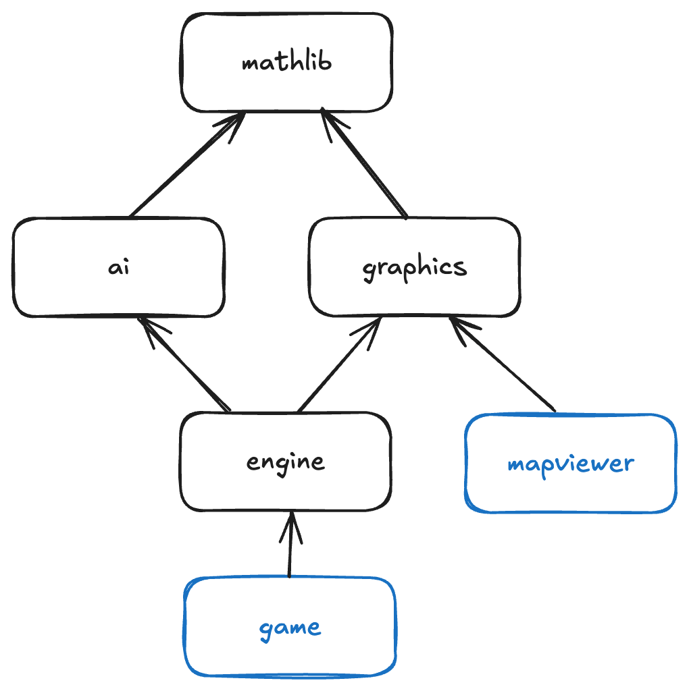
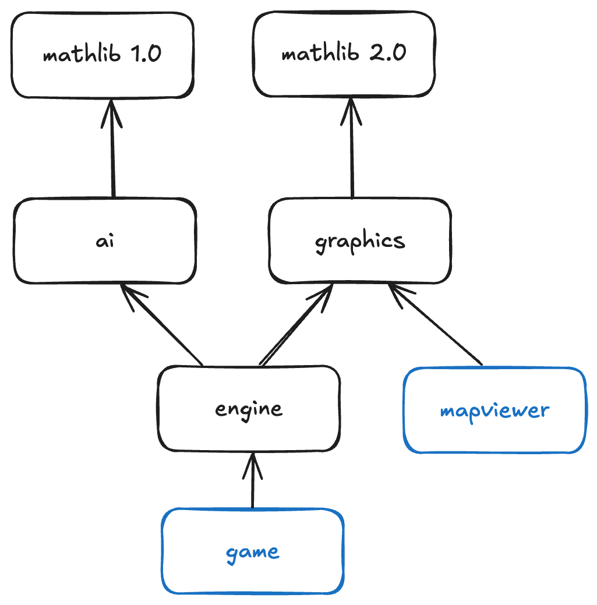

# Conan Diamond dependency exploration

Given a couple of packages that depend on eachother in the following graph dependency, we want to explore deeper the diamond dependency issue and how we can solve it.



## Dependency conflict

We can create a dependency conflict by having two separate versions for `mathlib`.



## Running it locally

1. Set up local artifactory by running:
   ```
   docker run --name artifactory -d -p 8081:8081 -p 8082:8082 releases-docker.jfrog.io/jfrog/artifactory-cpp-ce:7.63.12
   ```
